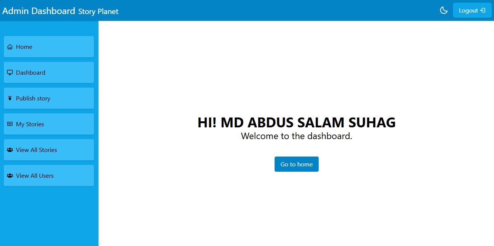
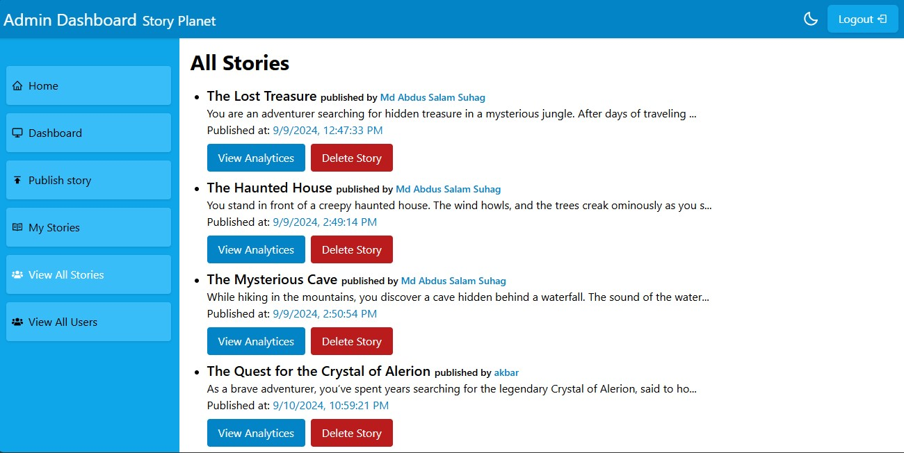

# [Story Planet - MERN Stack Website](https://story-planet.vercel.app)

**Read or publish stories with branching narratives.**

## Features

### Branching Narrative Stories:

- Users can read stories with branching narratives.
- During the story, users can make choices between two options to influence the story's path.

### User Authentication:

- Users can register and log in to read stories.
- Three account types are available: **Reader**, **Author**, **Admin**

### Role-Based Access:

- **Reader**: Can read all stories by logging in.
- **Author**: Can read, publish, and manage their own stories and view analytics.
- **Admin**: Can manage all stories and users.

## Technologies Used

### Frontend

- **React** (Packages used: `react-hook-form`, `react-router-dom`, `react-toastify`, `react-icons`)
- **Tailwind CSS**

### Backend

- **Express.js** (Packages used: `mongoose`, `jsonwebtoken`, `bcryptjs`)
- **Node.js**
- **MongoDB**

## Admin Dashboard

### Screenshots

**Admin Dashboard:**

**All Stories View:**

